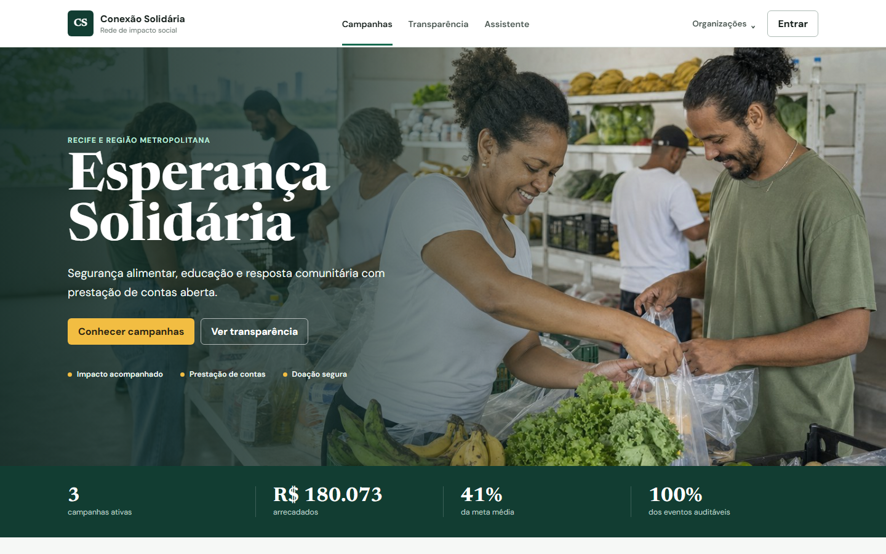
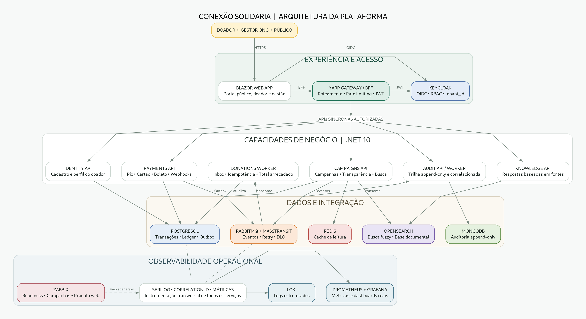
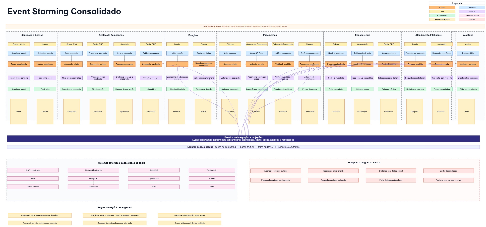
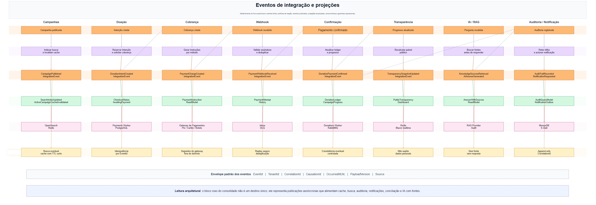

# FIAP Conexão Solidária

[](https://github.com/louresb/fiap-conexao-solidaria/actions/workflows/ci.yml)

Projeto desenvolvido para o Hackathon da pós-graduação em Arquitetura de Sistemas .NET da FIAP. A plataforma conecta organizações, doadores e campanhas com pagamentos, processamento assíncrono, transparência e auditoria ponta a ponta.



## Arquitetura



A aplicação combina Blazor, YARP, Keycloak e serviços .NET 10 com MassTransit/RabbitMQ. PostgreSQL mantém o estado transacional, Redis e OpenSearch atendem projeções de leitura e MongoDB preserva a auditoria append-only.

- [Diagrama editável em Graphviz](docs/architecture/platform-architecture.dot)
- [Decisões de persistência em PDF](docs/architecture/data-storage-decisions.pdf)
- [Topologia de entrega AWS e Azure](docs/architecture/deployment-topology.png)

## Capacidades

| Área | Implementação |
|---|---|
| Experiência | Portal público, área do doador e gestão de campanhas em Blazor Web App |
| Segurança | Keycloak OIDC, JWT, roles `GestorONG` e `Doador`, rate limiting e tenant no token |
| Doações | Intenção, pagamento sandbox Pix/cartão/boleto, Outbox/Inbox e processamento idempotente |
| Transparência | Campanhas ativas, valor arrecadado, busca fuzzy e cache com `X-Cache: HIT/MISS` |
| Auditoria | Eventos por tenant e correlação em MongoDB, com consulta autorizada |
| Conhecimento | Respostas baseadas em documentos verificados, sempre acompanhadas das fontes |
| Observabilidade | Serilog, Correlation ID, Prometheus, Grafana, Loki e web scenarios no Zabbix |
| Plataforma | Docker Compose, Kubernetes, Helm, Terraform AWS/Azure e GitHub Actions |

## Executar no Kubernetes

### Pré-requisitos

- Windows PowerShell 5.1 ou PowerShell 7
- Docker Desktop com Kubernetes habilitado
- `kubectl` com o contexto `docker-desktop`
- .NET SDK definido em [`global.json`](global.json)

### Instalação completa

```powershell
git clone https://github.com/louresb/fiap-conexao-solidaria.git
cd fiap-conexao-solidaria
kubectl config use-context docker-desktop
.\scripts\Deploy-KubernetesLocal.ps1 -Reset
```

O script gera credenciais locais, constrói imagens imutáveis, aplica os manifests e o Helm chart, aguarda os rollouts, configura usuários no Keycloak, provisiona o cenário do Zabbix e abre os port-forwards.

> [!NOTE]
> As credenciais são geradas em `.env`, que não é versionado. Nenhum segredo de runtime está no repositório.

### Verificação funcional

```powershell
.\scripts\Test-KubernetesLocal.ps1
kubectl get pods -n conexao-solidaria
```

O smoke test verifica readiness, Redis MISS/HIT, busca fuzzy, JWT/RBAC, isolamento entre tenants, pagamento, mensageria, atualização assíncrona, auditoria, fontes da Knowledge API, Prometheus, Grafana e Zabbix.

> [!TIP]
> Em uma nova aplicação sem mudanças de código, use `.\scripts\Deploy-KubernetesLocal.ps1 -SkipBuild`.

## Endpoints locais

| Serviço | Endereço |
|---|---|
| Produto | http://localhost:31080 |
| Gateway e health checks | http://localhost:31081 |
| Keycloak | http://localhost:31082 |
| RabbitMQ Management | http://localhost:32672 |
| Grafana | http://localhost:31090 |
| Prometheus | http://localhost:31091 |
| Zabbix | http://localhost:31092 |
| Identity API - Scalar | http://localhost:31101/scalar/v1 |
| Campaigns API - Scalar | http://localhost:31102/scalar/v1 |
| Payments API - Scalar | http://localhost:31103/scalar/v1 |
| Audit API - Scalar | http://localhost:31104/scalar/v1 |
| Knowledge API - Scalar | http://localhost:31105/scalar/v1 |

Usuários locais:

- Gestor: `gestor.esperanca@conexaosolidaria.local`
- Doador: `doador.esperanca@conexaosolidaria.local`
- As senhas estão em `DEMO_MANAGER_PASSWORD` e `DEMO_DONOR_PASSWORD` no `.env`.
- Grafana usa `admin`; Zabbix usa `Admin`; RabbitMQ usa `conexao`. As respectivas senhas também estão no `.env`.

## Docker Compose

Como alternativa ao Kubernetes:

```powershell
.\scripts\Start-Local.ps1 -Build -Tools -Operations
.\scripts\Test-Local.ps1
.\scripts\Stop-Local.ps1
```

## Qualidade e entrega

```powershell
dotnet restore ConexaoSolidaria.slnx
dotnet build ConexaoSolidaria.slnx --configuration Release --no-restore
dotnet test ConexaoSolidaria.slnx --configuration Release --no-build --no-restore
```

O workflow [`Platform CI/CD`](.github/workflows/ci.yml) executa build, testes, validação Helm/Terraform, Trivy, SBOM e build das oito imagens. Imagens são publicadas no GHCR; espelhamento para ECR/ACR e deploy EKS/AKS são habilitados por variáveis de ambiente protegidas.

## Discovery

[](https://miro.com/app/board/uXjVH48WBvk=/?moveToWidget=3458764679031794026&cot=14)

[](https://miro.com/app/board/uXjVH48WBvk=/?moveToWidget=3458764679107645340&cot=14)
