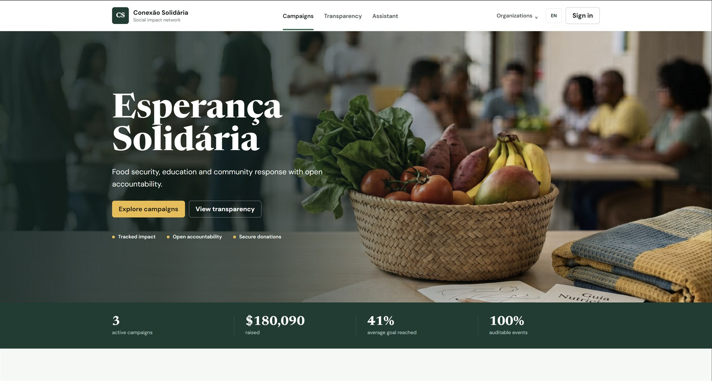
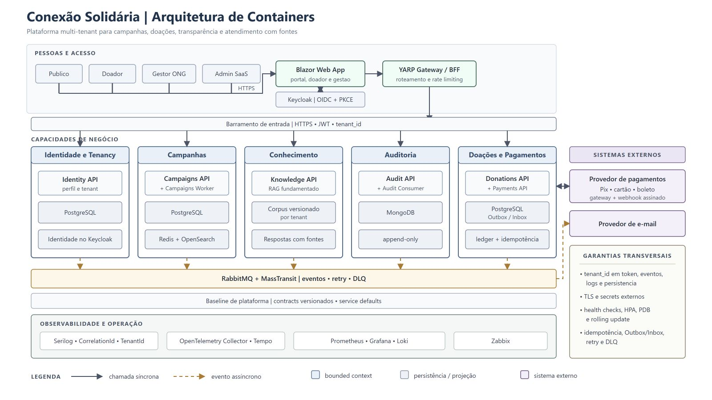
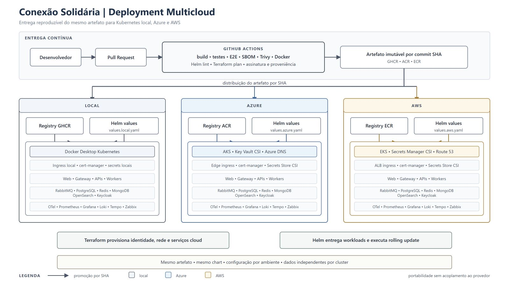

# FIAP Conexão Solidária

[](https://github.com/louresb/fiap-conexao-solidaria/actions/workflows/ci.yml)
[](https://github.com/louresb/fiap-conexao-solidaria/tags)

Projeto desenvolvido para o Hackathon da pós-graduação em Arquitetura de Sistemas .NET da FIAP. A plataforma conecta organizações, doadores e campanhas com pagamentos, processamento assíncrono, transparência e auditoria ponta a ponta.

[](https://conexao-solidaria-blouresfiap26.chilecentral.cloudapp.azure.com/)

## Produto

| Área | Implementação |
|---|---|
| Experiência | Portal público, área do doador e gestão de campanhas em Blazor Web App, com português e inglês |
| Segurança | Keycloak OIDC, JWT, RBAC, rate limiting e isolamento lógico por tenant |
| Doações | Pix, cartão e boleto em sandbox, com Outbox/Inbox e processamento idempotente |
| Transparência | Campanhas ativas, valores arrecadados, busca fuzzy e cache com `X-Cache: HIT/MISS` |
| Auditoria | Eventos append-only por tenant e correlação, persistidos no MongoDB |
| Conhecimento | Assistente RAG com fontes verificadas, isolamento por tenant e fallback determinístico |
| Operação | Logs, métricas e traces com Serilog, OpenTelemetry, Prometheus, Grafana, Loki, Tempo e Zabbix |

## Arquitetura

[](https://lucid.app/lucidchart/6e80164b-4cca-4f4e-9aa7-a6f7ab7cd923/edit?invitationId=inv_0c5180ba-f12a-4d44-a002-8ae873e177de&page=26DfIEDjgP1E#)

A solução utiliza .NET 10, Blazor, YARP e Keycloak em unidades de deploy independentes. MassTransit e RabbitMQ sustentam os fluxos assíncronos; PostgreSQL preserva o estado transacional; Redis e OpenSearch atendem projeções de leitura; MongoDB mantém a trilha de auditoria. `TenantId`, `CorrelationId` e `TraceId` atravessam requisições, eventos e telemetria.

- [Decisões arquiteturais](docs/architecture/decisions/README.md)
- [Modelo de segurança](docs/security/security-model.md)

### Entrega multi-cloud

[](https://lucid.app/lucidchart/8cc6f156-fa26-45d7-91a3-c1571126d5fb/edit?invitationId=inv_8378f368-9687-45b8-8d96-f7206c9b6397&page=phEfYmhT_bZQ#)

O mesmo conjunto de imagens e o mesmo Helm chart são promovidos por GitHub Actions para GHCR, ACR e ECR. Os ambientes AKS e EKS mantêm configurações e dados independentes, enquanto Terraform, Helm values e autenticação OIDC preservam uma entrega reproduzível sem credenciais permanentes no GitHub.

- [Runbook de publicação Azure e AWS](docs/operations/cloud-deployment.md)

## Executar localmente

### Pré-requisitos

- Windows PowerShell 5.1 ou PowerShell 7
- Docker Desktop com Kubernetes habilitado
- `kubectl` com o contexto `docker-desktop`
- .NET SDK definido em [`global.json`](global.json)

```powershell
git clone https://github.com/louresb/fiap-conexao-solidaria.git
cd fiap-conexao-solidaria
kubectl config use-context docker-desktop
.\scripts\Deploy-KubernetesLocal.ps1 -Reset
```

O script gera as credenciais locais, constrói imagens imutáveis, instala a plataforma, configura os usuários do Keycloak e abre os port-forwards necessários.

> [!NOTE]
> Os segredos locais são gerados em `.env`, que não é versionado. Os ambientes cloud utilizam Azure Key Vault e AWS Secrets Manager via Secrets Store CSI.

### Validar a plataforma

```powershell
.\scripts\Test-KubernetesLocal.ps1
kubectl get pods -n conexao-solidaria
```

O smoke test cobre readiness, Redis MISS/HIT, busca fuzzy, JWT/RBAC, isolamento entre tenants, pagamento, RabbitMQ, atualização assíncrona, auditoria, RAG com fontes e observabilidade. A jornada principal também é validada por testes Playwright.

> [!TIP]
> Para reaplicar a plataforma sem reconstruir as imagens, use `.\scripts\Deploy-KubernetesLocal.ps1 -SkipBuild`.

<details>
<summary>Endpoints locais e contas de avaliação</summary>

| Serviço | Endereço |
|---|---|
| Produto | http://localhost:31080 |
| Gateway e health checks | http://localhost:31081 |
| Keycloak | http://localhost:31082 |
| RabbitMQ Management | http://localhost:32672 |
| Grafana | http://localhost:31090 |
| Prometheus | http://localhost:31091 |
| Zabbix | http://localhost:31092 |
| Tempo | http://localhost:31093 |
| Identity API - Scalar | http://localhost:31101/scalar/v1 |
| Campaigns API - Scalar | http://localhost:31102/scalar/v1 |
| Payments API - Scalar | http://localhost:31103/scalar/v1 |
| Audit API - Scalar | http://localhost:31104/scalar/v1 |
| Knowledge API - Scalar | http://localhost:31105/scalar/v1 |
| Donations API - Scalar | http://localhost:31106/scalar/v1 |

- Gestor: `gestor.esperanca@conexaosolidaria.local`
- Doador: `doador.esperanca@conexaosolidaria.local`
- As senhas estão em `DEMO_MANAGER_PASSWORD` e `DEMO_DONOR_PASSWORD` no `.env`.
- Grafana usa `admin`, Zabbix usa `Admin` e RabbitMQ usa `conexao`; as senhas também estão no `.env`.

</details>

Para encerrar o ambiente local sem remover os dados persistidos:

```powershell
.\scripts\Stop-KubernetesLocal.ps1
```

## Qualidade e entrega

```powershell
dotnet restore ConexaoSolidaria.slnx --locked-mode
dotnet build ConexaoSolidaria.slnx --configuration Release --no-restore
dotnet test ConexaoSolidaria.slnx --configuration Release --no-build --no-restore --filter "Category!=E2E"
```

O workflow [`Platform CI/CD`](.github/workflows/ci.yml) executa build, testes, E2E, validação Helm/Terraform, Trivy, SBOM e build das nove imagens. Publicação nos registries privados e deploys Kubernetes usam imagens identificadas pelo SHA do commit.

## Discovery

[](https://miro.com/app/board/uXjVH48WBvk=/?moveToWidget=3458764679031794026&cot=14)

[](https://miro.com/app/board/uXjVH48WBvk=/?moveToWidget=3458764679107645340&cot=14)

<details>
<summary>Créditos</summary>

- [OpenAI Codex](https://openai.com/codex/) — apoio à implementação e revisão técnica.
- [Google Gemini](https://gemini.google.com/) — geração das imagens institucionais e de campanhas.
- [Miro](https://miro.com/) — Event Storming.
- [Lucidchart](https://www.lucidchart.com/) — diagramas de arquitetura.

</details>
