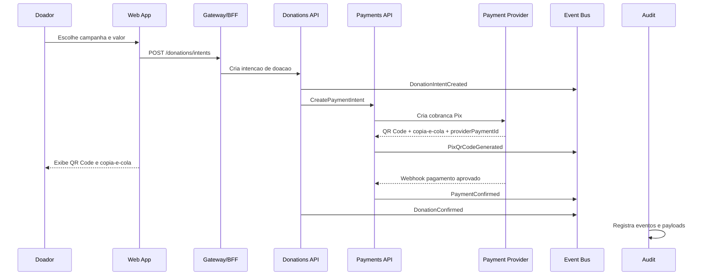

# Estrategia de pagamentos

## Objetivo

Pagamentos devem ser tratados como um contexto de dominio, nao como um botao fake no checkout. Para a demo, o fluxo deve mostrar Pix com QR Code/copia-e-cola, status assincrono, webhook, idempotencia, auditoria e confirmacao de doacao.

## Decisao recomendada para o MVP

Implementar uma abstracao de gateway:

- `IPaymentGateway`
- `FakePixGateway` para demo local sem credenciais
- `MercadoPagoPixGateway` como primeira integracao real/sandbox candidata
- `StripePixGateway` como alternativa internacional quando a conta suportar Pix
- `PagarMePixGateway` como alternativa brasileira futura

O MVP deve funcionar sem depender de conta real. Quando houver credenciais, o mesmo fluxo usa sandbox do provedor.

## Por que Pix entra cedo

- Pix e o principal metodo de pagamento brasileiro para doacoes rapidas.
- QR Code/copia-e-cola e visualmente forte em demo.
- Webhook assinado e idempotencia demonstram maturidade backend.
- O fluxo assincrono combina com event-driven architecture.
- Doacao recorrente pode evoluir para Pix Automatico/recorrencia conforme provedor.

## Provedores candidatos

| Provedor | Papel no projeto | Observacao |
|---|---|---|
| Bacen API Pix | Referencia normativa/OpenAPI | Usar como base conceitual; integracao direta exige PSP/seguranca fora do escopo do MVP. |
| Mercado Pago | Primeira opcao pragmatica para sandbox Pix no Brasil | Boa historia para hackathon: conta dev, Pix, webhooks e APIs conhecidas. |
| Stripe Pix | Alternativa forte para arquitetura global | Boa para narrativa SaaS global, mas depende da disponibilidade/capability da conta. |
| Pagar.me | Alternativa brasileira robusta | Boa evolucao para gateway nacional e conciliacao mais completa. |

## Fluxo MVP



## Entidades conceituais

| Entidade | Responsabilidade |
|---|---|
| PaymentIntent | Representa tentativa de pagamento para uma doacao. |
| PaymentCharge | Dados da cobranca no provedor: QR Code, expiration, providerPaymentId. |
| PaymentWebhook | Payload recebido do provedor, assinatura e processamento. |
| PaymentLedgerEntry | Registro financeiro imutavel de confirmacao, estorno ou falha. |
| PaymentProviderAccount | Configuracao por tenant/provedor, sem segredo hardcoded. |

## Estados

```text
Created -> WaitingPayment -> Paid -> Confirmed -> Settled
Created -> WaitingPayment -> Expired
Created -> WaitingPayment -> Failed
Paid -> Refunded
```

## Eventos

- PaymentIntentCreated
- PixChargeCreated
- PixQrCodeGenerated
- PaymentWebhookReceived
- PaymentConfirmed
- PaymentExpired
- PaymentFailed
- DonationConfirmed
- PaymentSettlementRecorded
- PaymentRefundRequested
- PaymentRefunded

## Regras de seguranca

- Secrets do provedor nunca entram no Git.
- Webhook deve validar assinatura/token do provedor.
- Webhook deve ser idempotente por `providerEventId`.
- Valor, moeda, tenant e campaignId nao podem ser alterados apos criacao da cobranca.
- Status interno deve ser mapeado a partir do status do provedor.
- Nenhum dado de cartao deve ser armazenado pela plataforma.
- Logs nao devem gravar token, chave Pix, documento sensivel ou payload completo sem classificacao.
- Todo evento financeiro deve gerar auditoria.

## UI esperada

### Checkout Pix

- Identidade visual da ONG.
- Campanha, valor e impacto estimado.
- QR Code Pix.
- Campo copia-e-cola com botao copiar.
- Expiracao da cobranca.
- Timeline de status: aguardando, confirmado, processado.
- Link para voltar a campanha.

### Confirmacao

- Recibo de demo.
- Protocolo/correlationId.
- Campanha apoiada.
- Proximo passo da ONG.
- Link para acompanhar prestacao de contas.

### Gestor

- Doacoes por status.
- Falhas/webhooks pendentes.
- Valor confirmado vs aguardando.
- Filtro por campanha, canal e provedor.

## Demo sem credenciais

Quando nao houver provedor real configurado, o `FakePixGateway` deve:

- gerar QR Code visual e copia-e-cola ficticio;
- criar `providerPaymentId` deterministico;
- permitir botao de simulacao "confirmar pagamento";
- publicar os mesmos eventos que o gateway real publicaria;
- marcar claramente que e sandbox/demo.

## Evolucao

1. Fake Pix local.
2. Mercado Pago sandbox.
3. Webhook assinado e idempotente.
4. Conciliacao por job.
5. Estorno.
6. Doacao recorrente.
7. Provider routing por tenant.
8. Relatorio financeiro e settlement.

## Fontes tecnicas a revisar

- Bacen Pix API: https://github.com/bacen/pix-api
- Bacen Swagger Pix API: https://bacen.github.io/pix-api/
- Mercado Pago Pix: https://www.mercadopago.com.br/developers/en/docs/checkout-bricks/payment-brick/payment-submission/pix
- Mercado Pago Webhooks: https://www.mercadopago.com.br/developers/en/docs/your-integrations/notifications/webhooks
- Stripe Pix: https://docs.stripe.com/payments/pix
- Pagar.me Pix: https://docs.pagar.me/docs/pix-1
- Pagar.me Webhooks: https://docs.pagar.me/reference/vis%C3%A3o-geral-sobre-webhooks

